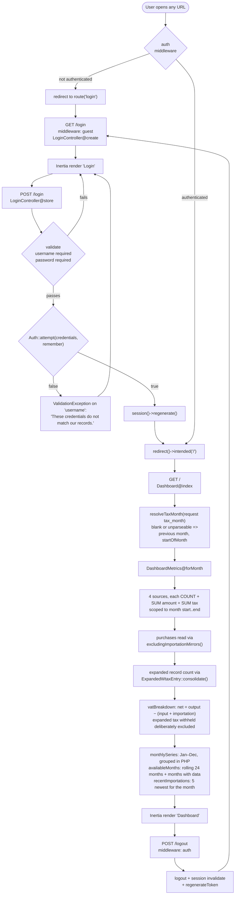
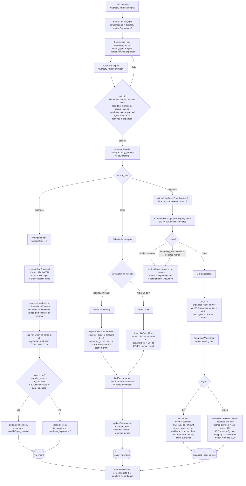
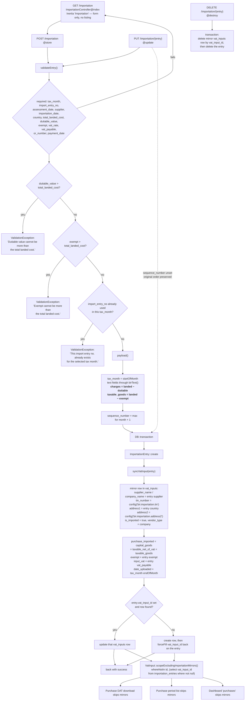
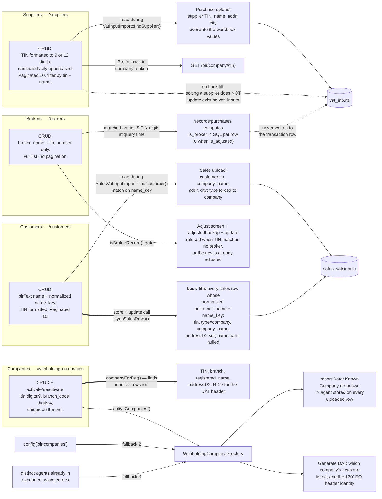
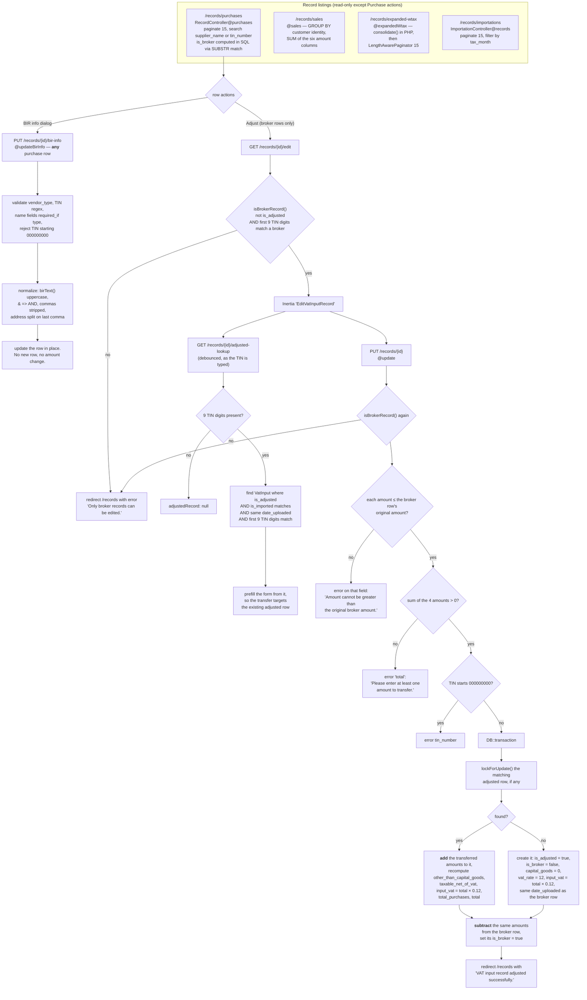
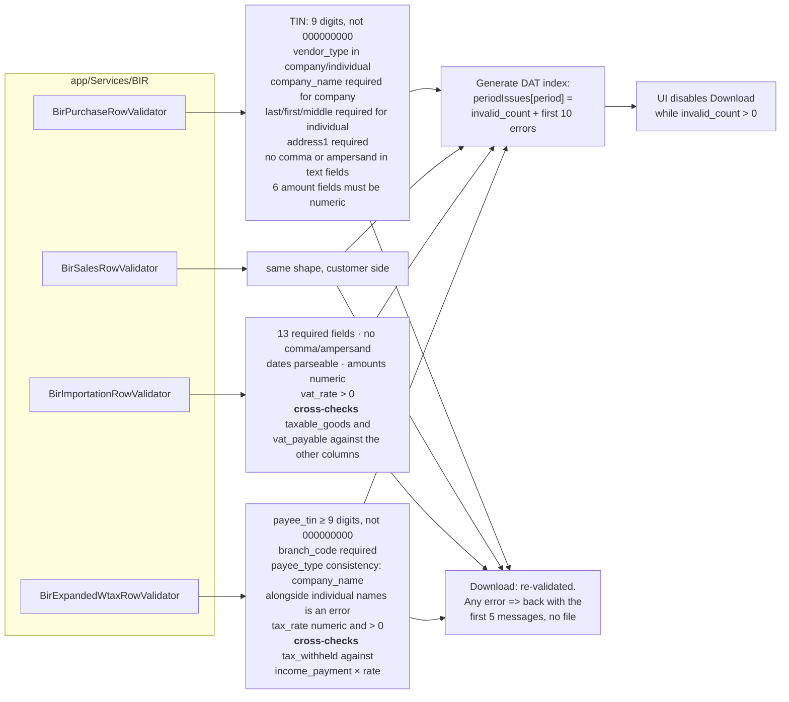
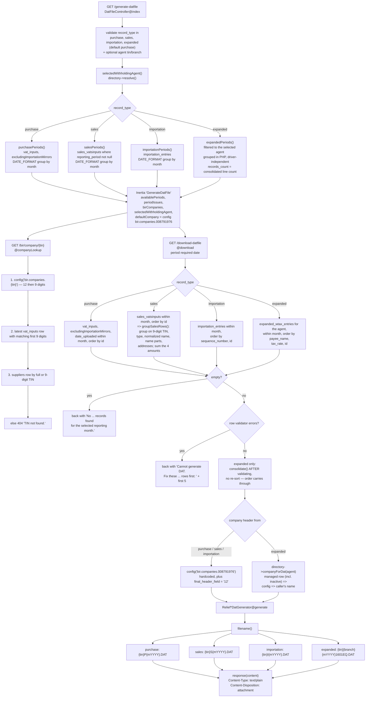

# System Flow / Workflow Diagram

Derived entirely from the current implementation — [routes/web.php](../routes/web.php), the
controllers in [app/Http/Controllers/](../app/Http/Controllers/), the importers in
[app/Imports/](../app/Imports/), the services in [app/Services/BIR/](../app/Services/BIR/), and the
Inertia pages in [resources/js/Pages/](../resources/js/Pages/).

Every route, table, file name and rule shown below exists in the code. Nothing is planned,
inferred, or aspirational. Where a module deliberately does *not* connect to another, that is
stated rather than left out.

---

## 1. System map

The four data modules are independent stores. They meet in exactly two places: the Dashboard,
which aggregates them, and Generate DAT File, which emits one file per module.

```mermaid
flowchart TD
    Login["/login<br/>LoginController"]
    Dash["/ (Dashboard)<br/>DashboardMetrics"]

    Login -->|"Auth::attempt OK<br/>intended('/')"| Dash

    subgraph DT["Data &amp; Transactions"]
        Import["/records<br/>Import Data (upload only)"]
        Imprt["/importation<br/>Importation manual entry"]
        Gen["/generate-datfile<br/>Generate DAT File"]
    end

    subgraph ST["Stores"]
        VI[("vat_inputs")]
        SV[("sales_vatsinputs")]
        EW[("expanded_wtax_entries")]
        IE[("importation_entries")]
    end

    subgraph MD["Master Data"]
        Sup["/suppliers"]
        Cus["/customers"]
        Brk["/brokers"]
        Cmp["/withholding-companies"]
    end

    subgraph RC["Record (read + maintain)"]
        RP["/records/purchases"]
        RS["/records/sales"]
        RE["/records/expanded-wtax"]
        RI["/records/importations"]
    end

    Dash --> DT
    Dash --> MD
    Dash --> RC

    Import -->|purchase| VI
    Import -->|sales| SV
    Import -->|expanded| EW
    Imprt --> IE
    IE -.->|"syncVatInput mirror"| VI

    Sup -.->|"read at upload"| Import
    Cus -.->|"read at upload<br/>+ back-fill on save"| SV
    Brk -.->|"gates Adjust"| RP
    Cmp -.->|"withholding agent"| Import
    Cmp -.->|"1601EQ header"| Gen

    VI --> RP
    SV --> RS
    EW --> RE
    IE --> RI

    VI --> Gen
    SV --> Gen
    EW --> Gen
    IE --> Gen

    Gen --> DAT["`.DAT` download"]

    VI --> Dash
    SV --> Dash
    EW --> Dash
    IE --> Dash
```

Sidebar grouping is defined in [app-sidebar.jsx](../resources/js/Components/app-sidebar.jsx):
**Main Menu** (Dashboard) · **Data & Transactions** (Import Data, Importation, Generate DAT File) ·
**Record** (4 listings) · **Master Data** (Customers, Suppliers, Brokers, Companies) · footer Log out.

---

## 2. Login → Dashboard



**Source columns per module** ([DashboardMetrics::SOURCES](../app/Services/BIR/DashboardMetrics.php#L45)):

| Module | Table | Month column | Amount | Tax |
| --- | --- | --- | --- | --- |
| Sales | `sales_vatsinputs` | `reporting_period` | `net_amount` | `output_vat` |
| Purchases | `vat_inputs` | `date_uploaded` | `total_purchases` | `input_vat` |
| Importation | `importation_entries` | `tax_month` | `total_landed_cost` | `vat_payable` |
| Expanded | `expanded_wtax_entries` | `reporting_period` | `income_payment` | `tax_withheld` |

---

## 3. Import Data → Purchase / Sales / Expanded WTAX

One screen, one endpoint, three branches. The type is always chosen explicitly on the form — it is
never inferred from the workbook.



Branch-specific behaviour worth calling out, because it is **not** symmetric:

| | Purchase | Sales | Expanded WTAX |
| --- | --- | --- | --- |
| Preflight check | none | none | `ExpandedWtaxUploadPreflight` |
| Re-upload same month | merges into matching rows | `updateOrCreate` per document | **deletes the month for that agent, then re-imports** |
| Master Data read | `Supplier` | `Customer` | `WithholdingCompany` (as agent, not payee) |
| Withholding agent stored on row | no | no | yes (`withholding_agent_tin`/`branch_code`/`name`) |
| Amounts | derived/summed where columns are absent | read from fixed column offsets | BIR layout: stored as filed. System layout: income payment computed from tax and rate |

---

## 4. Importation manual entry

The only module keyed by hand. Each entry is mirrored into `vat_inputs` so the purchase DAT engine
can emit it — and that mirror is then excluded from the purchase DAT and from dashboard purchases,
so the same transaction is never counted twice.



`charges` and `taxable_goods` are the only derived amounts; the entry screen shows them read-only.
`config('bir.importation.tin')` is currently `000-472-103-000`, carrying a `TODO` in
[config/bir.php](../config/bir.php#L25) to confirm the Bureau of Customs TIN used for filing.

---

## 5. Master Data → transaction wiring

This is the part that is easiest to get wrong by assumption, so each of the four is drawn with the
*exact* point at which it touches a transaction. Two are read-only at upload time; one back-fills
existing rows; one is matched at query time and never stored on the row.



Enforced rules on **Companies**, which exist because expanded rows carry the agent by value rather
than by foreign key ([WithholdingCompanyController](../app/Http/Controllers/WithholdingCompanyController.php)):

- `hasFiledRows()` true → **TIN and branch cannot be edited**; the message tells the user to add a
  new company instead.
- `hasFiledRows()` true → **DELETE is refused**; deactivate instead.
- Deactivated companies are hidden from the dropdowns but `companyForDat()` still finds them, so a
  month already filed under one can still be regenerated.
- Directory priority is **managed active → config → already-uploaded**; first occurrence of a
  `tin|branch_code` pair wins, so a later source never overrides an earlier one.

---

## 6. Record listings, validation, and Broker adjustment



The adjustment is a **transfer, not a copy**: the four amounts are subtracted from the broker row
and added to a real-vendor row that carries `is_adjusted = true`. The pair therefore still sums to
the original total, and because an `is_adjusted` row is never itself adjustable, the transfer cannot
cascade.

### Where row validation actually runs

The four `Bir*RowValidator` services are **not** invoked during upload. They run only on the
Generate DAT screen — once to annotate each period, and again to block the download.



Upload-time checking is separate and exists only for Expanded WTAX
(`ExpandedWtaxUploadPreflight`: missing columns, and rows whose month falls outside the selected
month). Purchase and Sales uploads store whatever parses and are first judged at DAT time.

---

## 7. Generate DAT File



Two asymmetries in the current implementation, both deliberate in the code comments:

1. **Only Expanded WTAX is filed per company.** Purchase, Sales and Importation build their header
   from the hardcoded `config('bir.companies.008791976')` entry regardless of what is selected on
   screen. The Known Company selector appears only in expanded mode.
2. **Expanded periods are grouped in PHP**; purchase, sales and importation period listings use
   MySQL's `DATE_FORMAT`, so those three listings are MySQL-only.

---

## 8. Route → controller → store reference

| Method | Route | Controller | Reads / writes |
| --- | --- | --- | --- |
| GET | `/login` | `LoginController@create` | — (guest) |
| POST | `/login` | `LoginController@store` | `users` |
| POST | `/logout` | `LoginController@destroy` | session (auth) |
| GET | `/` | `Dashboard@index` | all 4 stores, read-only |
| GET | `/records` | `VatInputController@index` | directory (companies) |
| POST | `/vat-import` | `VatInputController@import` | `vat_inputs` / `sales_vatsinputs` / `expanded_wtax_entries` |
| GET | `/records/purchases` | `RecordController@purchases` | `vat_inputs` + `brokers` |
| GET | `/records/sales` | `RecordController@sales` | `sales_vatsinputs` |
| GET | `/records/expanded-wtax` | `RecordController@expandedWtax` | `expanded_wtax_entries` |
| GET | `/records/importations` | `ImportationController@records` | `importation_entries` |
| GET | `/records/{id}/adjusted-lookup` | `VatInputController@adjustedLookup` | `vat_inputs` (JSON) |
| GET | `/records/{id}/edit` | `VatInputController@edit` | `vat_inputs` + `brokers` gate |
| PUT | `/records/{id}` | `VatInputController@update` | `vat_inputs` (2 rows) |
| PUT | `/records/{id}/bir-info` | `VatInputController@updateBirInfo` | `vat_inputs` (1 row) |
| GET | `/generate-datfile` | `DatFileController@index` | period + issue listing |
| GET | `/bir/company/{tin}` | `DatFileController@companyLookup` | config → `vat_inputs` → `suppliers` |
| GET | `/download-datfile` | `DatFileController@download` | the selected store, read-only |
| GET/POST/PUT/DELETE | `/brokers`, `/create`, `/brokers/{id}` | `ManageBrokerController` | `brokers` |
| GET/POST/PUT/DELETE | `/suppliers`, `/suppliers/{id}` | `SupplierController` | `suppliers` |
| GET/POST/PUT/DELETE | `/customers`, `/customers/{id}` | `CustomerController` | `customers` + back-fills `sales_vatsinputs` |
| GET | `/importation` | `ImportationController@index` | — (form only) |
| POST/PUT/DELETE | `/importation`, `/importation/{entry}` | `ImportationController` | `importation_entries` + mirrored `vat_inputs` |
| GET/POST/PUT/DELETE | `/withholding-companies`, `/{company}` | `WithholdingCompanyController` | `withholding_companies` |
| PATCH | `/withholding-companies/{company}/deactivate` | `@deactivate` | `withholding_companies.is_active` |
| PATCH | `/withholding-companies/{company}/activate` | `@activate` | `withholding_companies.is_active` |

Every route except `GET /login`, `POST /login` is inside the `auth` middleware group; `GET /login`
and `POST /login` are inside `guest`.

---

## 9. What is deliberately absent

Stated so the diagram is not read as incomplete:

- **No Broker adjustment for Sales, Expanded WTAX or Importation.** The Adjust flow exists only on
  purchase rows, gated by a broker TIN match.
- **No Suppliers back-fill.** Editing a supplier does not rewrite existing `vat_inputs` rows; only
  Customers back-fill (`syncSalesRows`).
- **No upload path for Importation.** It is manual entry only.
- **No manual entry for Purchase, Sales or Expanded WTAX.** They are upload only; existing purchase
  rows can be corrected through the BIR-info dialog and the Adjust screen, but not created by hand.
- **No per-company selection for Purchase / Sales / Importation DAT.** Header identity is the
  hardcoded config company.
- **No foreign key from `expanded_wtax_entries` to `withholding_companies`.** The agent is carried
  by value, which is why the controller enforces deactivate-not-delete and locks TIN/branch edits.
- **No expanded withholding tax in the VAT breakdown.** `vatBreakdown()` reads only sales, purchase
  and importation tax; 1601EQ tax withheld is reported on its own card.
